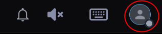
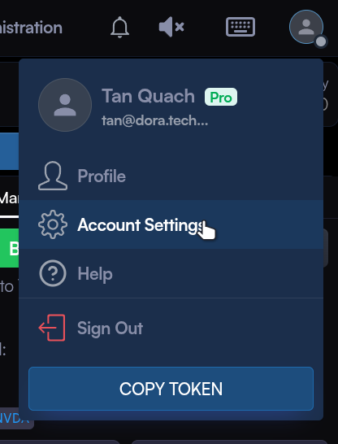
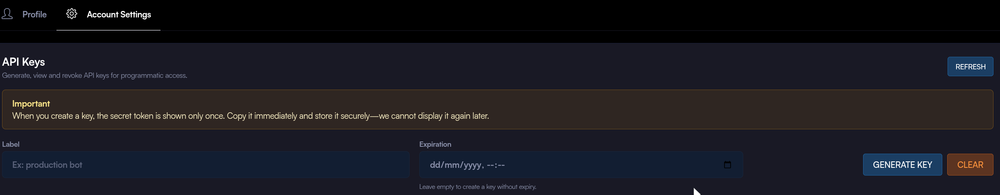

# Getting started with the DORA API

- [Getting started with the DORA API](#getting-started-with-the-dora-api)
  - [Introduction](#introduction)
  - [Authentication](#authentication)
    - [Bearer Token](#bearer-token)
    - [API Key](#api-key)
      - [API Key Management via DORA UI](#api-key-management-via-dora-ui)
      - [API Key Management via API](#api-key-management-via-api)
    - [Using the API Key for Authentication](#using-the-api-key-for-authentication)
    - [Listing your API Keys](#listing-your-api-keys)
    - [Revoking an API Key](#revoking-an-api-key)
    - [Logging in to the DORA UI via API key](#logging-in-to-the-dora-ui-via-api-key)
    - [Streaming APIs](#streaming-apis)
    - [Market Data](#market-data)
    - [User Specific Data](#user-specific-data)
  - [Using the API](#using-the-api)
    - [User configuration](#user-configuration)
    - [Deposits And Withdrawals](#deposits-and-withdrawals)
    - [Assets](#assets)
      - [Coupons](#coupons)
    - [Order books](#order-books)
    - [Orders](#orders)
      - [Submitting orders](#submitting-orders)
        - [Error responses for invalid orders](#error-responses-for-invalid-orders)
      - [Cancelling orders](#cancelling-orders)
      - [Updating orders](#updating-orders)
      - [Querying orders](#querying-orders)
      - [Closing positions](#closing-positions)
      - [Bulk order placement](#bulk-order-placement)
    - [Ledgers](#ledgers)
    - [Accounts](#accounts)
      - [Creating isolated accounts](#creating-isolated-accounts)
        - [Example: creating an isolated position on-the-fly](#example-creating-an-isolated-position-on-the-fly)
        - [Example: using an existing isolated position](#example-using-an-existing-isolated-position)
      - [Maximum leverage](#maximum-leverage)
        - [Example: Setting leverage on an order](#example-setting-leverage-on-an-order)
    - [Leverage operations](#leverage-operations)
    - [Reporting](#reporting)
      - [Trades](#trades)
      - [Transactions](#transactions)
    - [Historical Data](#historical-data)

## Introduction

The DORA platform provides a digital marketplace for trading fractionalized bonds
opening a new era of financial inclusion.

The DORA API allows developers to interact with the platform programmatically,
enabling them to build applications that can trade, make markets, manage positions
and analyse market data on the DORA platform.

## Authentication

At present, DORA's API requires authentication via a Bearer token or an API key.

### Bearer Token

To obtain a Bearer token, you need to log in to the DORA UI using your credentials.

Once logged in, you can find your authentication token in the user menu by clicking
on your user avatar in the top right corner.

Click on the `COPY TOKEN` button to copy your authentication token to the clipboard.

You can then use this token to authenticate your API requests by including it in the
`Authorization` header as follows:

```html
Authorization: Bearer <your-authentication-token>
```

Authentication tokens are valid for a limited time and will need to be refreshed
periodically using the method above.

### API Key

#### API Key Management via DORA UI

Log into DORA as usual, using the user menu in the top right corner,



choose the account settings option from the menu.



This will load the account settings page where you will be able to generate
your API keys.



In the `Label` box, give a name for your api, this is to help you remember what the key is for.

You can optionally set an expiration date for the key. If an expiration date is set
the key will automatically become invalid at the expiration time.

Click the `Generate Key` button to generate the key, you will be presented with a
dialog presenting you with the key id, the label you selected, and the generated key.

You will be warned to save the generated key as it cannot be displayed again after
you close the dialog.

The keys you have generated will be listed below the API Key Generation section. To revoke
any key, choose the key you want to revoke and press the `Revoke` button.

#### API Key Management via API

To create an API key for the first time, you will need to use your Bearer token
to authenticate the request. Follow the steps above to obtain your authentication token.

> Note: This authentication token is refreshed periodically for security reasons.
> if you encounter authentication issues while using the API, please repeat the
> steps above to obtain a new token, then try again.

Once you have your authentication token, you can use the following `curl` command
to request a new API key:

```bash
curl -L -X POST -H "Authorizatio: Bearer <YOUR TOKEN>" -H "Content-Type: application/json" --data '{"label": "your-label-for-identifying-this-key"}' https://staging.dora.co/v1/user/apikey
```

If you receive an error response like this:

```json
{
  "error":"unauthorized: token has invalid claims: token is expired",
  "metadata":{
    "status_code":401,
    "trace_id":"staging-019b9916-a6cb-7f12-a897-f1a7ca750ee7",
    "request_id":"staging-019b9916-a6cb-7f15-89d5-0a7023e32dac"
  }
}
```

The authorization key you provided is invalid or expired. See note above for details.
Obtain a new token from the DORA UI and try again.

If the request is successful, you will receive a response like this:

```json
{
  "data": {
    "key_id": "unique identifier for your key",
    "api_key": "your-generated-api-key",
    "label": "your-label-for-identifying-this-key"
  },
  "metadata": {
    ... metadata fields ...
  }
}
```

The `key_id` is the unique identifier for your api key and will be required when you
want to delete the key. When requesting your list of keys, this identifier is provided
in the response.

The `label` is the identifying label you provided when creating the key.

The `api_key` is the key you will use to authenticate your API requests to DORA. Please
store this value securely, as it will not be shown again. If you lose this value, you
will need to delete the key and create a new one.

### Using the API Key for Authentication

Once you have generated your API key, you can use it to authenticate your requests to
DORA's API. To do this, replace the `Bearer <token>` part of your Authorization header
with `ApiKey <your-generated-api-key>`

**Example:**

Replace this:

```bash
curl -L -X GET -H "Authorization: Bearer <token> ...

```

With this:

```bash
curl -L -X GET -H "Authorization: ApiKey <your-generated-api-key> ...
```

For streaming API requests, you need to provide the api key as a query parameter instead of in the header.
The query parameter to pass is `x-api-key`.

**Example:**

```bash
wscat -c "wss://staging.dora.co:8085/v1/orderbooks/<order_book_id>/open/stream?since=2026-01-01T09:28:23.687804Z&x-api-key=<your-generated-api-key>
```

### Listing your API Keys

Once you have your generated API keys, you can start using them to authenticate your requests.
You can test that your key is working by listing your existing API keys.

```bash
curl -L -H "Authorization: ApiKey <your-generated-api-key>" -H "Content-Type: application/json" https://staging.dora.co/v1/user/apikey
```

You should receive a response like this:

```json
{
  "data": {
    "api_keys": [
      {
        "user_id": "your-user-id",
        "key_id": "unique identifier for your key",
        "label": "your-label-for-identifying-this-key",
        "expires_at": null,
        "is_active": true
      },
    ]
  },
  "metadata": {
    ... metadata fields ...
  }
}
```

### Revoking an API Key

To revoke an API key, you will need the `key_id` of the key you want to delete.
It is recommended to create a new API key before revoking an existing one to avoid any disruption in service.
Once you have created a new key, you can use the key in the request to revoke the old key.

If you revoked an API key that is currently in use, and you don't have another valid API key,
you will need to login to the DORA UI to generate a new authentication token to create a new API key.

To revoke an API key, you can make a `PUT` request to the following endpoint: `https://staging.dora.co/v1/user/apikey/{key-id}/revoke`

**Example:**

```bash
curl -L -X PUT -H "Authorization: ApiKey <your-generated-api-key>" -H "Content-Type: application/json" https://staging.dora.co/v1/user/apikey/{key_id}/revoke
```

### Logging in to the DORA UI via API key

The user's API key can also be used to log in to the DORA trading UI directly. Simply direct your browser to the
base URL for the DORA UI and use the `/login?apikey=<your-api-key>` path. E.g. `https://<base-dora-url>/login?apikey=<your-api-key>`.
This will allow users to be authenticated by their API key instead of having to use a username and password combination
and bypass the login screen for direct access to the DORA UI.

### Streaming APIs

DORA provides several websocket endpoints for real-time data streaming. These endpoints allow you to receive updates on
market data, user orders, transactions, and ledgers.

For streaming endpoints that require authentication, you need to provide your API key or bearer token as a query parameter.

For Bearer token authentication, use the `token` query parameter:

`GET /v1/user/{user_id}/orders/all/stream?token=<your-authentication-token>`

For API key authentication, use the `x-api-key` query parameter:

`GET /v1/user/{user_id}/orders/all/stream?x-api-key=<your-generated-api-key>`

All streaming endpoints allow users to fetch historical data before receiving the real-time updates. This is useful for
cases where you want to start processing data from a specific point in time. For example, if you disconnected from DORA
for a while, you can fetch the data you missed when not connected, before subscribing to the real-time updates.

### Market Data

The following endpoints are available for market data streaming:

`GET /v1/orderbook/{orderbook_id}/open/stream?[since=YYYY-MM-DDTHH:mm:ssZZZ]` provides L3 order book updates for the given order book.

`GET /v1/charts/{orderbook_id}/candle/stream?[since=YYYY-MM-DDTHH:mm:ssZZZ]&[resolution=XX]` provides candlestick bars
for the chosen resolution (e.g., 1 minute, 5 minutes, etc.) for the given order book. If no resolution is specified,
the default is 1 minute.

`GET v1/trades/{orderbook_id}/stream?[since=YYYY-MM-DDTHH:mm:ssZZZ]` provides trades that have been executed on the given order book,
i.e. tick data for the order book. This includes information about the price, volume, and time of each trade.
This endpoint is useful for tracking the history of trades and understanding market activity.

`GET /v1/prices/stream?[since=YYYY-MM-DDTHH:mm:ssZZZ]` provides the latest price updates for all assets on the DORA platform.
This endpoint is useful for tracking the current price of assets and understanding market trends.

It is also possible to filter the price stream by specific asset IDs using the `asset_id` query parameter
`GET /v1/prices/stream?asset_id={asset_id1}`.

To get a one-time snapshot of the current prices for all assets, you can use the endpoint: `GET /v1/price` which returns
the latest price for all assets on the DORA platform. If you want a one-time snapshot of the price for a specific asset only,
you can use the endpoint: `GET /v1/price/asset/{asset_id}`.

> **Note**: It is important to note that the price stream, or price snapshot endpoints should be used to get the latest price
> an asset is trading at on it's associated order book. This is due to the liquidity pool model used by DORA, where each order book
> is backed by a liquidity pool that determines the price of the asset based on supply and demand. All orders, whether market or limit
> orders, are matched against the liquidity pool.
>
> When a market order is placed, it is executed at the best available price in the liquidity pool. If the size of the market order
> is sufficiently large, it may impact the price of the asset in the liquidity pool, and move the price towards the top of the order book.
> If this happens, the market order may be partially filled by the liquidity pool until the price reaches the top of the order book, at
> which point, the resting orders on the order book are matched against the liquidity pool until they are filled. The remaining quantity of
> the market order is then filled at the new price level until it is completely filled, or the price moves an reaches the new top of the order book.
>
> When a limit order is placed, the matching engine will check the liquidity pool for the best available price. If the price set by
> the liquidity pool is better than the limit price set by the user, the order will be filled at the liquidity pool price.
> If the limit price is better than the liquidity pool price, the order will be added to the order book and matched when the price
> conditions are met.
>
> It is possible for large limit orders to impact the liquidity pool price as well, if the order size is sufficiently large.
> In this case, the limit order will be filled by the liquidity pool, if the pool price moves enough to trigger the next level of
> orders on the order book, they will continue to be filled and move the price until the orders on the order book are exhausted,
> and the price has not moved sufficiently to match against the top of the order book.
>
> It is also important to note that the mid price calculated from the best bid and ask prices in the order book may not be better
> than the liquidity pool price. This is why it is recommended to use the price stream or price snapshot endpoints to determine
> the latest asset price when market making or trading on the DORA platform.

`GET /v1/orderbook/{orderbook_id}/balances/stream?[since=YYYY-MM-DDTHH:mm:ssZZZ]` provides updates on the balances of the base and
quote asset of the order book. The balances provide a view of the current liquidity available in the underlying liquidity pool
associated with the order book.

### User Specific Data

`GET /v1/user/{user_id}/orders/all/stream?[since=YYYY-MM-DDTHH:mm:ssZZZ]` provides updates on all orders placed by a specific user.
This endpoint allows you to track the status of orders, including when they are placed, filled, or cancelled.

`GET /v1/user/{user_id}/ledger/stream?[since=YYYY-MM-DDTHH:mm:ssZZZ]` provides updates on the user's ledger, which includes positions
and balances available for trading etc.

`GET /v1/user/{user_id}/transactions/stream?[since=YYYY-MM-DDTHH:mm:ssZZZ]` provides updates on the user's transactions, generated
on the DORA platform. This includes deposits, withdrawals, coupon payments, and other financial activities.

## Using the API

### User configuration

DORA provides limited support for updating user account data. The endpoint:

`PUT /v1/user/config/self` is a shortcut for updating your user avatar url, or timezone. Any other user data changes must be done
via the DORA web application or through the user interface provided by the platform.

To retrieve your user configuration data, you can use the endpoint:

`GET /v1/user/self`

### Deposits And Withdrawals

As a SaaS platform, DORA does not hold deposits of assets that are tradable on the platform. DORA performs the matching and
maintains a ledger detailing the transactions and transfer of assets between the parties involved.

As such, DORA can only record deposits that have been received by integrators from their users, and perform verification
and authorization for withdrawals from DORA's platform when they are requested. The final authority for withdrawals lie
with the integrators themselves as is any payments taken from, or made to the user.

To accomplish this, DORA have provided deposit and withdrawal endpoints to facilitate the deposit and withdrawal workflow
to and from DORA. For more details of the deposit and withdrawal workflows, please see the [Integrator Deposits and Withdrawals](./integrator-deposits-and-withdrawals.md)
workflow document.


### Assets

An asset is a tradable item on the DORA platform. It can be a currency, a bond, or other financial instrument. Each order book
is associated with two assets: a base asset and a quote asset. The base asset is the asset being traded, while the quote asset
is the currency or equivalent used to price the base asset.

A list of all available assets can be retrieved using the endpoint:

`GET /v1/assets`

If the asset is a bond, it will have additional bond specific information, such as the coupon rate, maturity date,
and other relevant details.

This endpoint also provides a filter allowing you to query for specific asset types, such as currencies or bonds, and
specific properties, such as assets created before or after a certain date.

To retrieve detailed information about a specific asset, you can use the endpoint:

`GET /v1/assets/{asset_id}`

The asset ID is a UUID v7 unique identifier that is automatically generated by the system when the asset is created.

#### Coupons

For assets that are bonds, you can retrieve information about the coupons associated with the bond using the endpoint:

`GET /v1/assets/{asset_id}/coupons`

### Order books

On DORA, each order book is a market for trading a specific pair of assets, such as a bond and a currency.
The order book is matched with an underlying liquidity pool, which provides pricing and liquidity for the order book.
The pricing for the liquidity is driven by DORA's internal pricing algorithm.

Market orders are automatically executed against the pool, while limit orders are added to the order book and
matched with other orders when the price conditions are met.

To retrieve a list of all order books available on the DORA platform, you can use the endpoint:

`GET /v1/orderbooks`

To filter the order books, you can use query parameters such as `base_asset_id` and `quote_asset_id` to filter by
specific asset pairs, or `status` to filter by the status of the order book (e.g., open, closed, suspended).

The best way to get a list of order books that can be traded on is to call `GET /v1/orderbooks?status=OPEN` which
will return all active order books.

To retrieve detailed information about a specific order book, you can use the endpoint:

`GET /v1/orderbooks/{orderbook_id}`

The order book ID is a UUID v7 unique identifier that is automatically generated by the system when the order book
is created.

The API also provides 3 levels of market depth for order books:

- **Level 1 (L1)**: Best bid and ask prices, along with their respective volumes.
- **Level 2 (L2)**: Full order book with all bids and asks, including their prices and volumes.
- **Level 3 (L3)**: Full order book with individual orders, including their prices, volumes, and order IDs.

These can be accessed via the

- `GET /v1/orderbook/{orderbook_id}/L1`
- `GET /v1/orderbook/{orderbook_id}/L2`
- `GET /v1/orderbook/{orderbook_id}/L3`

endpoints. Additionally, you can subscribe to real-time updates for these levels via the streaming endpoints
as described in the "Streaming APIs" section.

A summary of the order book information can be retrieved using the endpoint:

`GET /v1/orderbooks/{orderbook_id}/summary` which provides a high-level overview of the order book,
including the best bid and ask prices, mid price and percentage spread.

### Orders

#### Submitting orders

To place an order on the DORA platform, you can use the endpoint:

`POST /v1/orders`

This endpoint allows you to submit a new order to the specified order book. The create order request looks like this:

```json
{
  "quantity": "100",  // number of units to buy/sell expressed as a string
  "inverse_leverage": 1.0, // the inverse leverage for the order, this is a decimal value between 0 and 1.0
  "price": "100.0", // required for limit orders, decimal value expressed as a string
  "kind": "limit", // the kind of order, can be "market" or "limit"
  "side": "buy", // the side of the order, can be "buy" or "sell"
  "from_global_position": true, // whether to use the global position for the order or an isolated position
  "order_book_id": "some-orderbook-id", // this must be a uuid v7 id of the order book you want to place the order on
  "order_modifiers": [
    "MAX_BUY"
  ], // optional order modifiers, can be used to modify the behavior of the order. Currently MAX_BUY is the only supported modifier.
  "good_till_date"": "2024-12-31T23:59:59Z", // optional good till date for the order, expressed in ISO 8601 format
  "trigger_price": "95.0", // optional trigger price for conditional orders, decimal value expressed as a string
  "trigger_type": "STOP_LOSS" // optional trigger type for conditional orders, can be "STOP_LOSS" or "TAKE_PROFIT"
}
```

For market orders, the `price` field is not required and should be omitted. Setting the `MAX_BUY` modifier allows the order to be
executed at the best available price, up to the specified quantity, without exceeding the user's available balance.

##### Error responses for invalid orders

In addition to the usual badly formed request errors, some of the common reasons why an order can be rejected:

- Order validation
  - Orderbook ID is missing or invalid.
  - Order quantity is missing or 0 value
  - Inverse Leverage is out of range (0.0 - 1.0)
  - Order kind is invalid (market or limit)
  - Order side is invalid (buy or sell)
  - Order price is negative
  - Good till date is in the past
  - Attempting to create a levered order from the global positions account
- Order is placed on an inactive order book.
- Order is placed on an unknown order book, i.e. incorrect order book ID.
- Leverage order is placed on an asset that is not supported for leverage trading.
- Leverage order is placed using `from_global_position` = `true` (leverage is only allowed in an isolated position account)
- Quantity on the order has more decimal places than the asset precision.
- Order price for limit orders has more decimal places than the asset precision.
- The requested leverage exceeds the leverage limit for the isolated position account.
    The leverage limit is set when the position is first created. To set a different
    leverage limit, the position must be closed, then opened with a new max leverage
    limit that does not exceed the maximum allowed limit for the asset. See [below](#maximum-leverage)
- The requested leverage exceeds the maximum allowed leverage for the asset. See [below](#maximum-leverage)
- The user does not have enough balance to place the order.

#### Cancelling orders

You can cancel an open limit order using the endpoint:

`DELETE /v1/orders/{order_id}`

The order ID is a UUID v7 unique identifier that is automatically generated by the system when the order is created.
Market orders will be automatically executed against the liquidity pool and cannot be cancelled once submitted.

If the order has already been filled, or has already been cancelled, the request will return an error, otherwise it
will return an updated order object showing the final state of the order when it was cancelled.

You can also cancel all your open orders at once with the endpoint:

`DELETE /v1/orders`

This will use the `user_id` from the authentication token to identify the user and cancel all their open orders.

#### Updating orders

It is not currently possible to update an existing order on the DORA platform. If you need to change an order, you must cancel it
and then place a new order with the desired changes. This may change in future iterations
of DORA.

#### Querying orders

To retrieve a list of your orders, you can use the endpoint:

`GET /v1/orders`

This endpoint allows you to filter orders by various parameters, such as `status`, `order_book_id`, `kind`, and `side`.
You can also provide a date range using the `from` and `to` query parameters to filter orders by their creation date.
If only a `from` date is provided, the API will return all orders created after that date. If only a `to` date is provided,
the API will return all orders created before that date. If both dates are provided, the API will return all orders
created within the specified date range.

To retrieve detailed information about a specific order, you can use the endpoint:

`GET /v1/orders/{order_id}`

The order ID is a UUID v7 unique identifier automatically generated by the system when the order is created.

To receive updates on your orders in real-time, you can subscribe to the streaming endpoint:

`GET /v1/user/{user_id}/orders/all/stream?[since=YYYY-MM-DDTHH:mm:ssZZZ]`

This will allow you to receive updates on all your orders, including when they are placed, filled, or cancelled.
It is recommended to use the `since` parameter to specify a starting point for the updates, so you can
catch up on any missed updates since your last connection. Once connected, you will receive real-time updates
on your orders as you place them, and they are processed, filled, or cancelled.

#### Closing positions

Typically, to close an existing position, you would need to place a new order in the opposite direction to offset the
existing position. For example, if you originally bought 100 units of an asset, and have a long open position,
you would need to place a sell order for 100 units to close the position. This can be done using the `POST /v1/orders` endpoint
as described earlier. Your order can be a market order or a limit order, depending on your preference. For example, to close
the position immediately at the best available price, you would place a market sell order for 100 units. Alternatively,
if you want to close the position at a specific price, you would place a limit sell order for 100 units at your desired price.

To create a quick market order to close an existing postion, you can use the endpoint `POST /v1/positions/close`. This
endpoint allows you to specify the id of the position and order book you want to close the position on. DORA will automatically
generate a market order with the correct quantity and side to close the position. The request body looks like this:

```json
{
  "position_id": "some-position-uuid", // the id of the position you want to close
  "order_book_id": "some-orderbook-uuid" // the id of the order book you want to close the position on
}
```

#### Bulk order placement

Bulk order placement is not currently supported in DORA, however we plan to offer this
functionality in future iterations of DORA.

### Ledgers

The DORA platform maintains a ledger for each user, which tracks their positions, balances, and other relevant information.
To retrieve your ledger, you can use the endpoint:

`GET /v1/ledger/positions/self`

Use your DORA user ID to retrieve your ledger. The user ID is a UUID v7 unique identifier that is automatically generated by
the system when your user account is created.

The position response looks like this:

```json
{
  "portfolio": {
    "user_id": "some-user-uuid",
    "positon": {
      "some-asset-uuid": {
        "some-position-uuid": {
          "id": "some-position-uuid",
          "asset_id": "some-asset-uuid",
          "seq": 1,
          "is_global": true,
          "available": "5000.0",
          "locked": "0.0",
          "supplied": "2000.0",
          "collateral": "0.0",
          "supplied_collateral": "0.0",
          "borrowed": "0.0",
          "impending_borrows": "0.0"
        },
        "some-other-position-uuid": {
          "id": "some-other-position-uuid",
          "asset_id": "some-other-asset-uuid",
          "seq": 2,
          "is_global": false,
          "available": "1000.0",
          "locked": "0.0",
          "supplied": "0.0",
          "collateral": "0.0",
          "supplied_collateral": "0.0",
          "borrowed": "0.0",
          "impending_borrows": "0.0"
        }
      },
      "some-other-asset-uuid": {
        ...
        // more positions for other assets
      },
      ... // more asset positions
    },
    "net_stablecoin_equivalence": {
      "gained": "1000.0", // the total amount of stablecoin equivalent gained
      "lost": "0" // the total amount of stablecoin equivalent lost
    }
  }
}
```

The `portfolio` object contains a map of asset IDs to their respective positions.
Each portfolio contains a single `global` position, which is a special position that represents the user's main account balance.
A position that is not flagged as `global` is an `isolated` position, which is similar to a sub-account or a specific trading
balance that has been created for a leveraged position.

To view just a list of all your global positions, you can use the endpoint:

`GET /v1/ledger/balances/self`

instead. You can also filter the positions by asset ID using the `asset_id` query parameter.

### Accounts

Asset positions are maintained within accounts, a user on the DORA network will
have one global position account, and may have multiple isolated accounts. In
the current version, the following rules apply:

- When a DORA user account is created by signing up for DORA, a global positions account is created for the user
- Users can trade through the global positions account, and positions for each asset will be created within this account.
- Users cannot use leverage when trading through the global positions account.
- Leverage can only be used within an isolated positions account.
- An isolated positions account can only hold positions in the assets associated with the order book being traded with leverage.
    For example, if a user creates an isolated account by trading BOND1/USD, the isolated account can only hold positions in BOND1 and USD.
- A user can have multiple isolated accounts, each tied to the assets of the order book they created a leveraged order on.
- Users cannot transfer bond asset balances between their global account and isolated accounts.
- Users can transfer USD balances only between their isolated accounts.
- Closing a position in an isolated account will automatically repay any borrows.
- Balances transferred to an isolated account will stay in the isolated account until the user chooses to move the money
    to another account.

#### Creating isolated accounts

When placing a new order, if you specify `from_global_position` as `false`, and there is no existing isolated
position for the asset being traded, a new isolated position will be created automatically for you. The required
funds will be transferred from your global position to the new isolated position, and the order will be placed using
the isolated position.

If an isolated position already exists for the asset being traded, and the `from_global_position` is set to `false`,
the order will be placed using the existing isolated position, as long as there are sufficient funds available in the
isolated position. If there are insufficient funds in the isolated position, the order will be rejected. To rectify this,
you need to transfer more funds to the isolated position from your global position or another isolated position using the
`POST /v1/positions/transfer_balances` endpoint.

When you close a position in an isolated account, any borrowed funds will be automatically repaid, and any remaining
balance will stay in the isolated account until you choose to transfer it to another account. As the USD balance remains
in the isolated account, you can use it to place new orders using leverage without needing to transfer funds from your
global position again, however, your order size will be limited based on the available balance, and the amount of
leverage you are using.

##### Example: creating an isolated position on-the-fly

1. You have a global position with 5000 USD available for trading.
2. You want to place a leveraged buy order for $100 units of a BOND1/USD using 2x leverage.
3. You place a new order using the `POST /v1/orders` endpoint, setting `from_global_position` to `false`.
4. Since there is no existing isolated position for BOND1/USD, a new isolated position is created automatically.
5. The required funds for the order is calculated and transferred from your global position to the new isolated position.
6. The order is placed using the new isolated position.

##### Example: using an existing isolated position

1. You have the above existing isolated position for \$100 of BOND1, you want to increase your position by placing another leveraged buy order for \$100 of BOND1/USD using 2x leverage.
2. You place a new order using the `POST /v1/orders` endpoint, setting `from_global_position` to `false`.
3. Since there is an existing isolated position account for BOND1/USD, the order is placed using the existing isolated position account.
4. As the isolated position account was created with only sufficient funds for the first order, the order is rejected due to insufficient funds.
5. You transfer an additional $100 from your global position account to the isolated position account using the `POST /v1/positions/transfer_balances` endpoint.
6. You re-submit the order, and it is successfully placed using the existing isolated position account.

#### Maximum leverage

The maximum leverage available per asset is determined by DORA and can be obtained from the asset data using the endpoint:
`GET /v1/assets/{asset_id}`. This information is provided in the `max_leverage` field of the asset data. This is the maximum
leverage that can be used when trading the asset on the DORA platform.

You can set the leverage on the order when placing a new order using the `inverse_leverage` field in the order request body.
The `inverse_leverage` is a decimal value between 0 and 1.0, where 1.0 represents no leverage (i.e., trading with your own funds),
and lower values represent higher leverage. For example, an `inverse_leverage` of 0.5 represents 2x leverage, while an `inverse_leverage` of 0.25 represents 4x leverage.

> Note: Inverse leverage is calculated as $1/Selected Leverage$ where Selected Leverage is the leverage value set on the order, e.g.
>
> - 2x leverage = $1/2 = 0.5$
> - 3x leverage = $1/3 = 0.3333$
> - 4x leverage = $1/4 = 0.25$

Once you have created a levered position in an isolated account, you cannot adjust the leverage for that position higher,
it will remain at the level set when the position was created. It is however possible to place additional leveraged orders
using a lower leverage level, as long as there are enough funds in the isolated account to cover the order size.
The lower leverage level set on the order will be used to calculate the required USD amount to cover the order size and affect
how much you need to borrow from the leverage module.

To change the leverage limit, you must close the existing position and create a new position in the isolated account.
By closing the position, the leverage for the isolated account is reset, allowing you to create a new position with
a different leverage level.

> Note: The leverage constraint set when a levered position is created is independent of the maximum leverage available for the asset.
> In DORA, this constraint is termed as the `leverage limit`. The leverage limit cannot be more than the maximum leverage available for the asset,
> and the leverage limit cannot be changed after the position is created. The leverage limit is reset once the position is closed.

##### Example: Setting leverage on an order

1. You have a global position with 5000 USD available for trading, and you have no isolated positions.
2. You want to place a leveraged buy order for $200 units of BOND2/USD using 4x leverage.
3. You check the maximum leverage for BOND2 using the `GET /v1/assets/{asset_id}` endpoint, and find that the maximum leverage is 5x.
4. You place a new order using the `POST /v1/orders` endpoint, setting `from_global_position` to `false`, and `inverse_leverage` to `0.25` (which represents 4x leverage).
5. A new isolated account is created automatically for BOND2/USD, and the required USD funds are transferred from your global position account to the new isolated account
    creating a new position for USD in the isolated account.
6. The order is placed using the new isolated position with 4x leverage.
7. The order is filled, the USD balance in the isolated account is reduced and a new position for BOND2 is created in the isolated account.
8. You decide to change your leverage to 3x for the same asset.
9. You close the existing position in the isolated account, which repays any borrowed funds and leaves any remaining balance in the isolated account.
10. You place a new order using the `POST /v1/orders` endpoint, setting `from_global_position` to `false`, and `inverse_leverage` to `0.3333` (which represents 3x leverage).
11. The order is placed using the existing isolated position with 3x leverage.
12. As long as the available funds remaining in your isolated position account for BOND2/USD is sufficient to cover your leveraged order, ou now have a position in
    BOND2/USD with 3x leverage in your isolated account.

### Leverage operations

The DORA platform allows users to supply assets to a leverage pool, borrow assets from the pool, and perform other associated operations.
The leverage pool is a shared pool of assets that provides liquidity for leveraged trading, and is separate from the liquidity pool used for
the order book.

To supply assets to the leverage pool, you can use the endpoint:

`POST /v1/leverage/supply`

This will transfer the specified amount of assets from your chosen position to the leverage pool, the balance will be reflected in your position,
and your available balance will be updated accordingly. The request body should look like this:

```json
{
  "position_id": "some-user-uuid", // the user ID of the user supplying the asset
  "asset_id": "some-asset-uuid", // the asset you want to supply
  "amount": "1000.0" // the amount of the asset to supply, expressed as a string
}
```

To withdraw assets from the leverage pool, you can use the endpoint:

`POST /v1/leverage/withdraw`

> TODO: Explain the borrowing and repaying operations, as well as the collateral and position isolation features.

### Reporting

DORA provides several endpoints for retrieving information for reporting and analysis purposes. In addition to the
orders API which allows you to retrieve historical information about your orders, you can also retrieve
information about the trades you have executed, and transactions that have occurred on the platform.

#### Trades

To get a list of trades that you have executed on the DORA platform, you can use the endpoint:

`GET /v1/trades`

> TODO: Describe the usage of this endpoint once the implementation has been completed.

#### Transactions

The DORA platform records all transactions, including orders, trades, and leverage operations.
To retrieve a list of transactions, you can use the endpoint:

`GET /v1/transactions`

This endpoint allows you to filter transactions by various parameters, such as `pools`, `user_ids`, `tx_kind`, and date ranges.

To retrieve information about a specific transaction, you can use the endpoint:

`GET /v1/transactions/{transaction_id}`

### Historical Data

DORA provides limited support for retrieving historical trade, order book, and candlestick data from the platform. In addition to the streaming endpoints
described earlier that allows you to fetch historical data before receiving real-time updates, you can also use the following endpoints:

- `GET /v1/trade?[pools=poolid1,poolid2,...]&[user_ids=user_id1,user_id2,...]&[tx_kind=kind1,kind2,...]&[from=YYYY-MM-DDTHH:mm:ssZZZ]&[to=YYYY-MM-DDTHH:mm:ssZZZ]`
- `GET /v1/charts/candle/{orderbook_id}/L3?[start=YYYY-MM-DDTHH:mm:ssZZZ]&[end=YYYY-MM-DDTHH:mm:ssZZZ]&[resolution=XX]`
