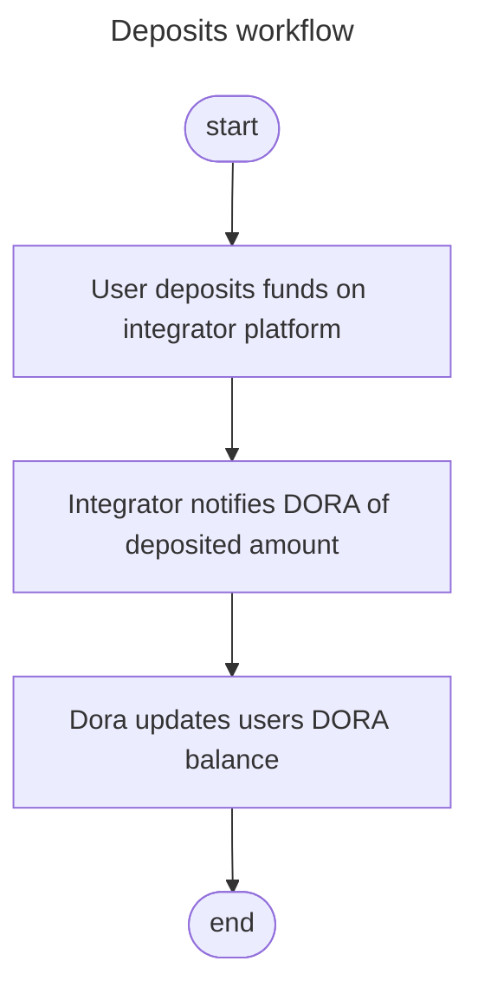
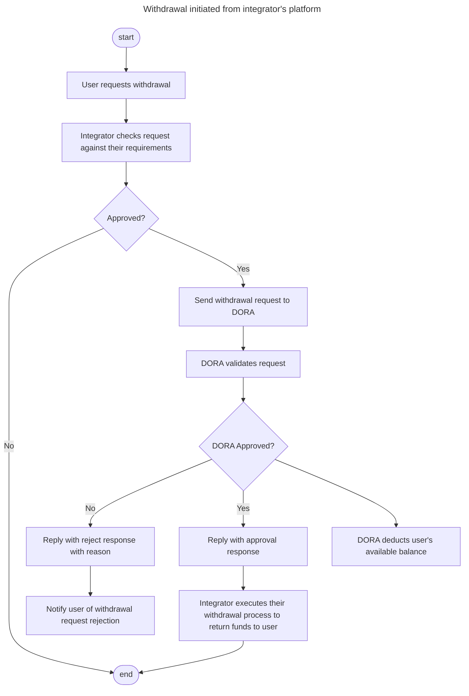
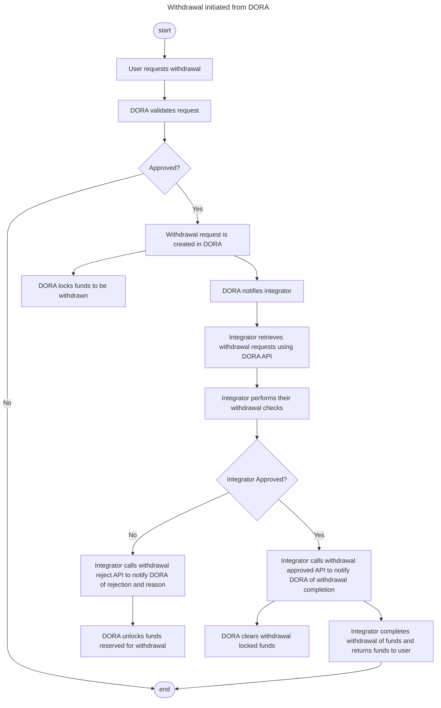
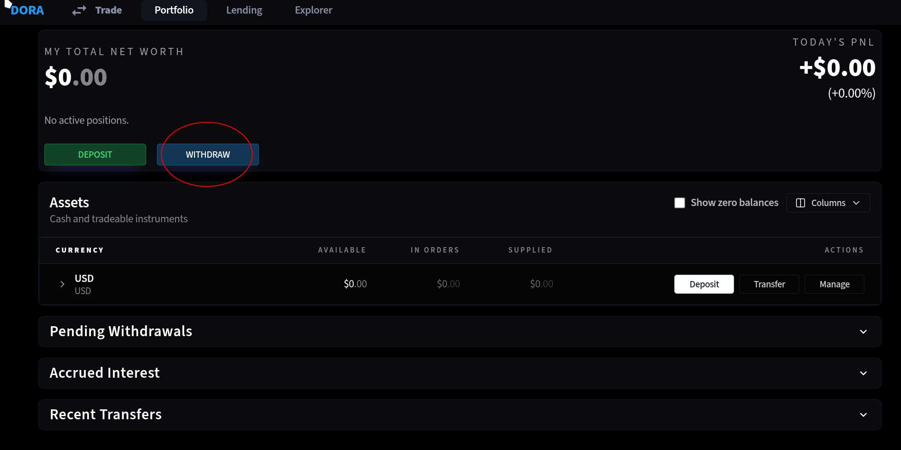
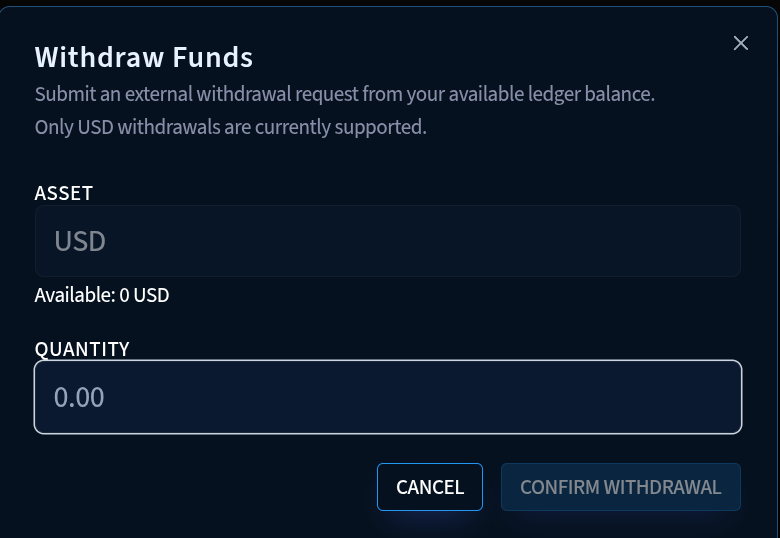

# Integrator Deposits and Withdrawals Workflow

## Introduction

This document describes the deposits and withdrawals workflow for integrators.

Deposits taken by integrators for funds to be traded on DORA will remain with the integrator as such, in order
for an integrator's user to be able to trade on DORA, the integrator must notify DORA of the deposits their users
make for trading on DORA.

Withdrawals on the other hand must first pass DORA's conditions for withdrawal before they can be made from the
integrator. DORA currently has several conditions that must be met before it can approve a withdrawal.

- Withdrawal can only be made from the global position account.
- Only USD can be withdrawn at this time. Bond withdrawals are not currently permitted.
- The user must have sufficient available balance on their global ppsition account.
- Withdrawals may be restricted if:
  - User has bad debt or is eligible for liquidation on any of their isolated position accounts.
  - Have negative PAC (Partially Accrued Coupons) from previous periods

Once DORA has received a withdrawal request, it will check the user's position and either approve or reject the request.
Depending on the withdrawal workflow (as detailed below). It will be up to the integrator to decide whether or not the
withdrawal can be made to their user, and it will be the integrator's responsibility to return the requested funds they
hold for the user.

## Deposits Workflow



Deposits are held on the integrator's platform, therefore deposits can only be taken on the integrator's platform and do
not involve DORA. Once a user has deposited the funds for trading on DORA with the integrator, it is the integrator's
responsibility to notify DORA of the amount deposited. The user's DORA account will not reflect the deposited amount until
the integrator has notified DORA of the deposit.

Integrators can notify DORA of a user's deposit using the `POST /v1/ledger/deposit/{user_id}` endpoint. `user_id` is the
DORA user id for the user which is generated by DORA when the user is added (see [Creating User via API](./integrator-users-and-login.md#creating-users-via-doras-api))

The body of the request looks like:

```json
{
    "asset_id": "dora_asset_id_for_usd",
    "quantity": "100"
}
```

in the example request body above, the user has deposited $100 for trading.

> Note: you must provide the DORA asset id for the USD currency in the request body
> The quantity reflects the amount to be deposited in the user's DORA global position account.

At this time, only USD can be deposited for by integrator's users for trading on DORA.

## Withdrawals Workflow

Withdrawals have two separate workflows depending on which platform the withdrawal request is made from. Below we discuss
the two workflows supported by DORA.

### Withdrawals initiated from the Integrator's platform



This workflow details the steps expected when a withdrawal request is made by a user using their integrator's platform.

In this instance, it is possible for the integrator to validate the user's request against their own restrictions
before initiating a request to DORA. Once the integrator has verified the request is valid on their systems, i.e. the
withdraw satisfies the requirements of the integrator, the integrator should send a withdrawal request to DORA for the
amount requested by the user. The request should be made to `POST /v1/ledger/withdraw/{user_id}` where `user_id` is
the DORA user id for the user which is generated by DORA when the user is added.

The body of the request should look like:

```json
{
    "asset_id": "dora_asset_id_for_usd",
    "quantity": "100"
}
```

> Note: you must provide the DORA asset id for the USD currency in the request body
> The quantity reflects the amount to be withdrawn from the user's DORA global position account.

Once received, DORA will perform the necessary checks as detailed above. If approved, DORA will return an approval response
and the integrator is free to refund the user the amount they requested.

If rejected, DORA will provide a reason in the response. The integrator should alert the user as to why the withdrawal request
was rejected and not refund the user.

### Withdrawals initiated from DORA



This workflow details the steps expected when a withdrawal request is made by a user using DORA's white labelled solution for
the integrator.



In this instance, DORA will validate the request first before notifying the integrator and making the withdrawal request available
to retrieve using the `GET /v1/ledger/withdraw/requests` endpoint.



If the request does not satisfy DORA's withdrawal requirements as stated above, the user will receive a rejection response from DORA
directly and no further processing will be done. The integrator will not be notified of any pending withdrawal requests to process.

If the request does satisfy DORA's withdrawal requirements, DORA will debit the requested amount from the user's available balance
and credit it to the user's pending withdrawal balance. The amount will remain in the pending withdrawal balance until the integrator
notifies DORA whether the user's request has been approved or rejected by the integrator.

It is expected that the integrator will retrieve the withdrawal requests from DORA and process them by checking if the withdrawal
requests satisfy their own withdrawal conditions, and then approve or reject the request.

If the integrator's withdrawal conditions have not been met, and they decide to reject the withdrawal request by calling
`POST /v1/ledger/withdraw/requests/{withdrawal_id}/reject`. This will tell DORA that the withdrawal request has been rejected by
the integrator and the user's locked withdrawal balances will be returned to their available balance.

If the integrator's withdrawal conditions have been met, and they approve the withdrawal request, they should notify DORA that the
request has been approved by calling `POST /v1/ledger/withdraw/requests/{withdrawal_id}/approve`. This will allow DORA to update
the user's locked withdrawal balance to reflect the funds have been removed from DORA.

> Note: It is the integrator's responsibility to return funds to the user after the withdrawal requests have been approved by both
> DORA and the integrator. DORA does not hold nor have any access to the user's funds and can in no way be responsible for any
> transfers of funds to an integrator's user.
