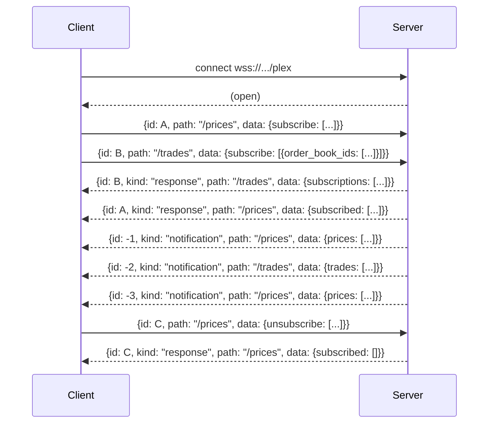
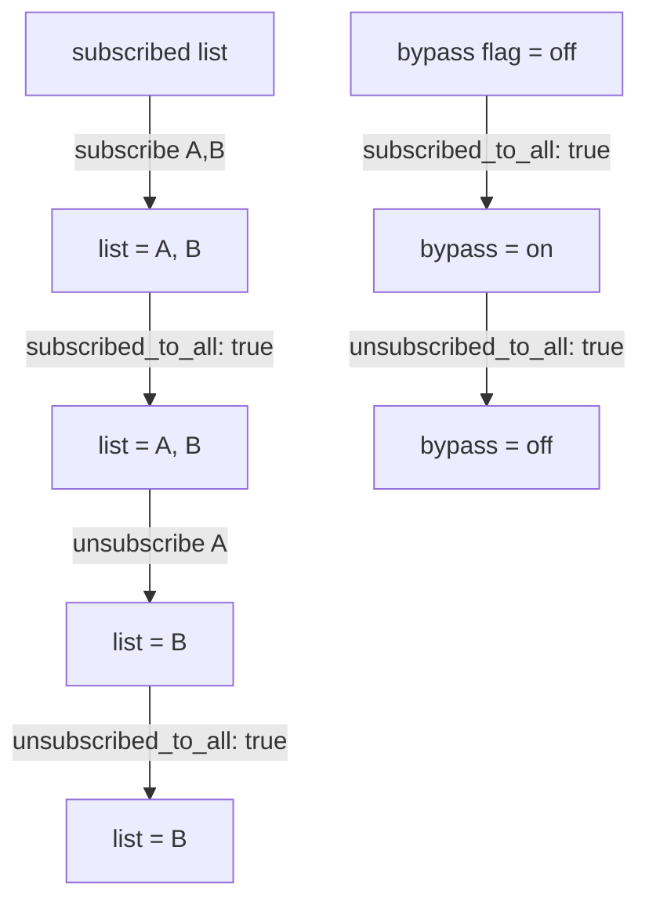

# Multiplexed WebSocket (`wsplex`)

DORA's **multiplexed WebSocket** protocol — `wsplex` — lets you carry requests, responses, and server-pushed notifications for multiple endpoints over a **single** connection. Where the [legacy streaming endpoints](../getting-started.md#streaming-apis) require one socket per stream, `wsplex` lets you subscribe to many streams and send many requests on one connection at once.

The endpoint is:

`wss://<environment_base_url>/plex`

For example, against staging: `wss://staging.dora.co/plex`.

Currently documented paths:

- [`/prices`](#path-prices) — real-time price updates for selected assets.
- [`/trades`](#path-trades) — trade updates by order book, optionally filtered by user.

Runnable examples in three languages:

- [Go](./examples/go/README.md)
- [Python](./examples/python/README.md)
- [TypeScript](./examples/typescript/README.md)

- [Multiplexed WebSocket (`wsplex`)](#multiplexed-websocket-wsplex)
  - [Connection & authentication](#connection--authentication)
  - [Protocol message shapes](#protocol-message-shapes)
    - [Request](#request)
    - [Response](#response)
    - [Notification](#notification)
  - [Request ID rule](#request-id-rule)
  - [Multiplexing on one connection](#multiplexing-on-one-connection)
  - [Path: `/prices`](#path-prices)
  - [Path: `/trades`](#path-trades)
  - [Adding new paths](#adding-new-paths)
  - [Error handling](#error-handling)
  - [Examples](#examples)

## Connection & authentication

The multiplexed WebSocket is reached at `wss://<environment_base_url>/plex`. Authentication uses the same header as the REST API:

`Authorization: ApiKey <your-api-key>`

`Authorization: Bearer <token>` works identically. Authorization is evaluated **per route** — `/prices` is public; `/trades` requires the token to have access to the relevant order books and users.

## Protocol message shapes

Every message on the wire is a JSON object. There are three kinds.

### Request

```json
{
  "id": "019ed20f-cfcb-7167-a318-4b42d0582517",
  "path": "/prices",
  "data": {
    "subscribe": ["8f050119-00ec-49dc-b8ce-9447262f1253"]
  }
}
```

| Field | Type | Required | Notes |
|---|---|---|---|
| `id` | UUIDv7 string | yes | Single-use per connection. See [Request ID rule](#request-id-rule). |
| `path` | string | yes | Must start with `/`. |
| `data` | object | **yes** | The `data` field is required. Omitting it returns an error response and still consumes the request id. |

### Response

Every request receives **exactly one** response with the matching `id`. A response either has `data` (success) or `error` (failure):

```json
{
  "id": "019ed20f-cfcb-7167-a318-4b42d0582517",
  "kind": "response",
  "path": "/prices",
  "data": {
    "subscribed": ["019ed211-7b09-7789-8f00-50b7cc90863d"],
    "subscribed_to_all": false
  }
}
```

```json
{
  "id": "019ed20f-cfcb-7167-a318-4b42d0582517",
  "kind": "response",
  "path": "/prices",
  "error": "handler error: EOF: wanted a non-nil JSON value of type api.SubscriptionChange, got empty body"
}
```

### Notification

Notifications are server-pushed; the client never sends them.

```json
{
  "id": "019ed20f-cfcb-7167-a318-4b42d0582517",
  "kind": "notification",
  "path": "/prices",
  "data": {
    "prices": [
      {
        "asset_id": "019c3401-9737-7106-b3d3-b7a6e6eef0e6",
        "price": "0.717414207417403554",
        "ytm": "0",
        "time": "2026-06-19T13:42:00.427375Z"
      }
    ]
  }
}
```

## Request ID rule

The `id` field is **single-use per connection**:

- Reusing any `id` on the same socket returns a duplicate-request error — even if the previous request failed validation or returned any other error.
- For retries (after any failure) you **must** generate a fresh id.
- Use **UUIDv7**. The id is the only thing correlating a response back to its request, so it must be unique within the connection's lifetime.

This rule applies even to malformed requests. Omitting the required `data` field still consumes the id.

## Multiplexing on one connection

A single `wsplex` connection can carry requests and responses for many paths at once, plus interleaved notifications from each path:



Responses and notifications can arrive in any order; the client correlates responses by `id` and routes notifications by `path`.

## Path: `/prices`

Subscribe to real-time price updates for selected assets or for all assets.

### Mental model

The server keeps two independent pieces of state for `/prices`:

- A **subscribed list** — a set of asset ids. `subscribe` adds ids, `unsubscribe` removes them.
- A **`subscribed_to_all` bypass flag** — when `true`, the bypass flag overrides the subscribed list and notifications are sent for every asset.

These two pieces of state are **independent**: `subscribe` and `unsubscribe` mutate the list regardless of the bypass flag; the bypass flag controls only whether the list is used as a filter.

| Field | Type | Notes |
|---|---|---|
| `subscribe` | `string[]` (asset ids) | Additive — adds to the subscribed list. |
| `unsubscribe` | `string[]` (asset ids) | Depreciative — removes from the subscribed list. Mutates the list even while the bypass flag is on. |
| `subscribed_to_all` | `bool` | Sets the bypass flag. When `true`, stream emits every asset. |
| `unsubscribed_to_all` | `bool` | Clears the bypass flag. When `false` (after being `true`), the stream filters by the already-mutated subscribed list. **Does not clear the list itself.** |

### Worked example

Assume the subscribed list starts empty and the bypass flag starts off.



Notifications at each step:

| Step | Request sent | List after | Bypass after | Notifications received |
|---|---|---|---|---|
| 1 | `{ subscribe: [A, B] }` | `[A, B]` | off | A, B |
| 2 | `{ subscribed_to_all: true }` | `[A, B]` | on | A, B, and every other asset |
| 3 | `{ unsubscribe: [A] }` | `[B]` | on | B, and every other asset (A is gone from the list but bypass is still on) |
| 4 | `{ unsubscribed_to_all: true }` | `[B]` | off | B only |

> Because the list and the bypass flag are independent, `unsubscribed_to_all` is **not** a list-clear. To fully tear down a `/prices` subscription, send an explicit `unsubscribe` for every id you originally added.

### Response data

```json
{
  "subscribed": ["019ed211-7b09-7789-8f00-50b7cc90863d"],
  "subscribed_to_all": false
}
```

### Notification data

```json
{
  "prices": [
    {
      "asset_id": "019c3401-9737-7106-b3d3-b7a6e6eef0e6",
      "price": "0.717414207417403554",
      "ytm": "0",
      "time": "2026-06-19T13:42:00.427375Z"
    }
  ]
}
```

## Path: `/trades`

Subscribe to real-time trade updates by order book, optionally filtered by user.

### Mental model

Same two-piece state model as `/prices`, applied to **two axes**:

- **Order-book axis** — a subscribed list of `order_book_ids`, plus an `order_books_all` bypass flag.
- **User axis** — a subscribed list of `user_ids`, plus a `users_all` bypass flag.

If neither `user_ids` nor `users_all` is set on a request, the user axis defaults to `users_all=true` for that request.

Both axes are independent of each other and of the request payload's other fields. `unsubscribe` mutates the list regardless of the bypass flag.

### Promote-to-max

When a single change object contains both an id-list and the corresponding `*_all` flag, the `*_all` flag wins:

- `order_books_all=true` overrides `order_book_ids` in the same change.
- `users_all=true` overrides `user_ids` in the same change.

When two different subscription changes overlap (sent in different requests), the server canonicalizes to the **broadest** effective subscription: combining `{"order_book_ids": [...],"users_all": true}` with `{"order_books_all": true,"user_ids": [...]}` is treated as a global all-users subscription.

### Important: connection-scoped all-mode

On `/trades`, `order_books_all=true` and `users_all=true` are **connection-scoped**: there is no `order_books_all: false` or `users_all: false` field, so once set, the bypass flag remains `true` for the lifetime of the connection. The cleanest way to fully clear subscription state on `/trades` is to close the connection.

### Request data

```json
{
  "subscribe": [
    { "order_book_ids": ["019c3420-5cd7-7a88-8fe6-a5a622e01ad9"], "users_all": true },
    { "order_books_all": true, "user_ids": ["019c4d37-311e-7a2f-8d58-f17c39170865"] }
  ],
  "unsubscribe": [
    { "order_book_ids": ["019c3420-5cd7-7a88-8fe6-a5a622e01ad9"], "user_ids": ["019c4d37-311e-7a2f-8d58-f17c39170865"] }
  ]
}
```

### Response data

```json
{
  "subscriptions": [
    { "order_books_all": true, "users_all": true }
  ]
}
```

### Notification data

`/trades` payloads intentionally match the legacy non-plex field names:

```json
{
  "trades": [
    {
      "transaction_id": "019ee01d-f5f4-775d-b14a-4164a31ee592",
      "asset_0": "019c3401-9737-7106-b3d3-b7a6e6eef0e6",
      "created_at": "2026-06-19T13:42:00.427375Z",
      "order_book_id": "019c3420-5cd7-7a88-8fe6-a5a622e01ad9",
      "order_id": "019ee01d-f570-77de-a7ff-99aae476b4e5",
      "order_seq": 1,
      "price": "0.717414207417403554",
      "quantity_0": "591.3390000000000000",
      "user_id": "019c4d37-311e-7a2f-8d58-f17c39170865",
      "side": "BUY",
      "aggressor_indicator": true
    }
  ]
}
```

## Adding new paths

Future paths will follow the same request / response / notification contract described above. They will be documented here as they are released. To consume a new path, send a request with the new `path` and parse the response / notifications using the same `id` and `path` routing rules already in your client.

## Error handling

Every error arrives as a response message with the matching `id`, `kind: "response"`, and an `error` string field. Validation errors and handler errors look the same to the client.

Two consequences:

1. A malformed request (e.g. omitting the required `data` field, or using a duplicate `id`) **still consumes the request id**. The next request must use a fresh UUIDv7.
2. The `error` string is intended for humans. Don't pattern-match on its content.

## Examples

Runnable demos and reusable helpers:

- [Go](./examples/go/README.md) — uses [`coder/websocket`](https://github.com/coder/websocket).
- [Python](./examples/python/README.md) — uses the [`websockets`](https://pypi.org/project/websockets/) package.
- [TypeScript](./examples/typescript/README.md) — uses the [`ws`](https://www.npmjs.com/package/ws) package.
