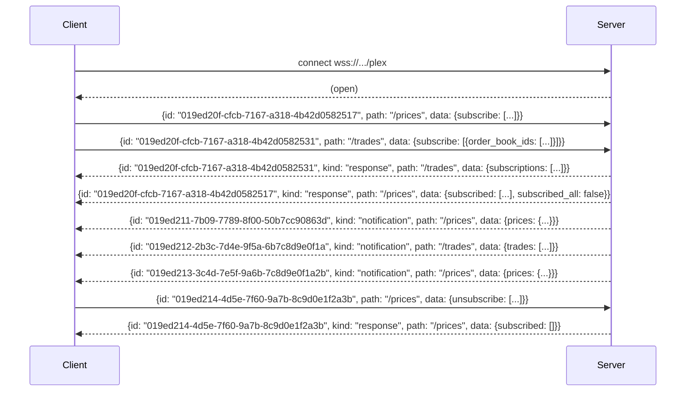

# Multiplexed WebSocket (`wsplex`)

DORA's **multiplexed WebSocket** protocol — `wsplex` — lets you carry requests, responses, and server-pushed notifications for multiple endpoints over a **single** connection. Where the [legacy streaming endpoints](../getting-started.md#streaming-apis) require one socket per stream, `wsplex` lets you subscribe to many streams and send many requests on one connection at once.

The endpoint is:

`wss://<environment_base_url>/plex`

For example, against staging: `wss://staging.dora.co/plex`.

Currently documented paths:

- [`/`](#path-) — list all available wsplex routes.
- [`/prices`](#path-prices) — real-time price updates for selected assets.
- [`/trades`](#path-trades) — trade updates by order book, optionally filtered by user.
- [`/assets`](#path-assets) — full asset updates.
- [`/orderbook/stats`](#path-orderbookstats) — orderbook market stats.
- [`/charts/candles`](#path-chartscandles) — streaming candles per resolution.
- [`/accounts/balance`](#path-accountsbalance) — account balances for one or more users (auth required).
- [`/pools/balance`](#path-poolsbalance) — pool balances.
- [`/orders/byuser`](#path-ordersbyuser) — order updates for a single user (auth required).
- [`/debug/notify`](#path-debugnotify) — debug route that echoes `data` after a delay.

Runnable examples in three languages:

- [Go](./examples/go/README.md)
- [Python](./examples/python/README.md)
- [TypeScript](./examples/typescript/README.md)

## Connection & authentication

The multiplexed WebSocket is reached at `wss://<environment_base_url>/plex`. Authentication uses the same header as the REST API:

`Authorization: ApiKey <your-api-key>`

`Authorization: Bearer <token>` works identically. **The `Authorization` header is required on the WebSocket upgrade request** — without it the connection will not be accepted. Once the socket is open, the same header authorizes requests on every path the token can access (for example, a token without `/trades` scope will see an error response on every `/trades` request, but the connection itself stays open).

A `User-Agent` header is **also required** on the WebSocket upgrade request. Send any non-empty string that identifies your client (for example, `MyDoraClient/1.0`). **Without it the server rejects the upgrade with HTTP `403`.** This header is only checked on the initial upgrade request; it is not needed on individual `wsplex` messages afterward.

## Protocol message shapes

Every message on the wire is a JSON object. There are three kinds.

### Request

```json
{
  "id": "019ed20f-cfcb-7167-a318-4b42d0582517",
  "path": "/prices",
  "data": {
    "subscribe": ["8f050119-00ec-49dc-b8ce-9447262f1253"]
  }
}
```

| Field | Type | Required | Notes |
|---|---|---|---|
| `id` | UUIDv7 string | yes | Single-use per connection. See [Request ID rule](#request-id-rule). |
| `path` | string | yes | Must start with `/`. |
| `data` | object | **yes** | The `data` field is required. Omitting it returns an error response and still consumes the request id. |

### Response

Every request receives **exactly one** response with the matching `id`. A response either has `data` (success) or `error` (failure):

```json
{
  "id": "019ed20f-cfcb-7167-a318-4b42d0582517",
  "kind": "response",
  "path": "/prices",
  "data": {
    "subscribed": ["019ed211-7b09-7789-8f00-50b7cc90863d"],
    "subscribed_all": false
  }
}
```

```json
{
  "id": "019ed20f-cfcb-7167-a318-4b42d0582517",
  "kind": "response",
  "path": "/prices",
  "error": "handler error: EOF: wanted a non-nil JSON value of type api.SubscriptionChange, got empty body"
}
```

### Notification

Notifications are server-pushed; the client never sends them. The `data` payload is route-specific. For `/prices`, `prices` is a **map keyed by asset id** (not an array):

```json
{
  "id": "019ed20f-cfcb-7167-a318-4b42d0582517",
  "kind": "notification",
  "path": "/prices",
  "data": {
    "prices": {
      "019c3401-9737-7106-b3d3-b7a6e6eef0e6": {
        "asset_id": "019c3401-9737-7106-b3d3-b7a6e6eef0e6",
        "price": "0.717414207417403554",
        "ytm": "0",
        "time": "2026-06-19T13:42:00.427375Z"
      }
    }
  }
}
```

## Request ID rule

The `id` field is **single-use per connection**:

- Reusing any `id` on the same socket returns a duplicate-request error — even if the previous request failed validation or returned any other error.
- For retries (after any failure) you **must** generate a fresh id.
- Use **UUIDv7**. The id is the only thing correlating a response back to its request, so it must be unique within the connection's lifetime.

This rule applies even to malformed requests. Omitting the required `data` field still consumes the id.

## Multiplexing on one connection

A single `wsplex` connection can carry requests and responses for many paths at once, plus interleaved notifications from each path:



Responses and notifications can arrive in any order; the client correlates responses by `id` and routes notifications by `path`.

## Path: `/`

List all available wsplex routes. Send an empty `data` object.

### Request data

```json
{}
```

### Example

```json
{"id":"019ee189-87d7-7c69-802a-8070f3779b90","path":"/","data":{}}
```

### Response data

```json
{
  "id": "019ee189-87d7-7c69-802a-8070f3779b90",
  "kind": "response",
  "path": "/",
  "data": {
    "routes": [
      "/",
      "/accounts/balance",
      "/assets",
      "/charts/candles",
      "/debug/notify",
      "/orderbook/stats",
      "/orders/byuser",
      "/pools/balance",
      "/prices",
      "/trades"
    ]
  }
}
```

## Path: `/prices`

Subscribe to real-time price updates for selected assets or for all assets.

### Mental model

The server has two pieces of state for `/prices`: a **subscribed list** of asset ids (initially empty) and a **`subscribed_all`** flag (initially `false`). The list is meaningful only while all-mode is off. When `subscribe_all` is `true`, the server streams every asset's prices and the `subscribed` list in the response is empty.

| Field | Type | Notes |
|---|---|---|
| `subscribe` | `string[]` (asset ids) | Additive — adds asset ids to the subscribed list. |
| `unsubscribe` | `string[]` (asset ids) | Subtractive — removes asset ids from the subscribed list. |
| `subscribe_all` | `bool` | When `true`, turns all-mode on. Every asset's prices stream regardless of the list. |
| `unsubscribe_all` | `bool` | When `true`, turns all-mode off. |

### Validation rules

The following combinations are rejected:

- Cannot combine `subscribe` with `subscribe_all`.
- Cannot combine `unsubscribe` with `unsubscribe_all`.
- Cannot combine `unsubscribe` with `subscribe_all`.

### Request data

```json
{"id":"019ee189-87d7-7c69-802a-8070f3779b91","path":"/prices","data":{"subscribe_all":true}}
```

### Response data

The response carries the post-change state. `subscribed` is an array of asset ids (empty when all-mode is on):

```json
{"id":"019ee189-87d7-7c69-802a-8070f3779b91","kind":"response","path":"/prices","data":{"subscribed":[],"subscribed_all":true}}
```

### Notification data

`prices` is a **map keyed by asset id**, not an array. Each value is the price record for that asset:

```json
{
  "kind": "notification",
  "path": "/prices",
  "id": "019ee189-87d7-7c69-802a-8070f3779ba1",
  "data": {
    "prices": {
      "019c3401-9737-7106-b3d3-b7a6e6eef0e6": {
        "asset_id": "019c3401-9737-7106-b3d3-b7a6e6eef0e6",
        "price": "0.717414207417403554",
        "ytm": "0",
        "time": "2026-06-19T13:42:00.427375Z"
      }
    }
  }
}
```

## Path: `/trades`

Subscribe to real-time trade updates by order book, optionally filtered by user.

### Mental model

`/trades` has two independent axes:

- **Order-book axis** — a list of `order_book_ids`, plus an `order_books_all` flag.
- **User axis** — a list of `user_ids`, plus a `users_all` flag.

`users_all: true` is the implicit default: if a change object omits both `user_ids` and `users_all`, the server treats the user axis as `users_all: true` for that change. The canonicalized subscription in the response always reflects this — `users_all: true` will appear even when the request did not set it.

`unsubscribe` is a full state edit (not just a list-edit). Sending `unsubscribe: [{order_books_all: true}]` clears the `order_books_all` flag and the response shows an empty `subscriptions` array, so all-mode is not connection-scoped — it can be cleared without closing the connection.

### Clearing subscriptions

To fully clear subscription state on `/trades`, send `unsubscribe` with the changes you want to remove. For example, `unsubscribe: [{order_books_all: true, users_all: true}]` returns `subscriptions: []`. There is no need to close the connection to reset.

### Request data

Each change object inside `subscribe` or `unsubscribe` may specify `order_book_ids` / `order_books_all` on the order-book axis and `user_ids` / `users_all` on the user axis.

```json
{
  "id": "019ee189-87d7-7c69-802a-8070f3779b92",
  "path": "/trades",
  "data": {
    "subscribe": [
      { "order_book_ids": ["019c3420-5cd7-7a88-8fe6-a5a622e01ad9"], "users_all": true },
      { "order_books_all": true, "user_ids": ["019c4d37-311e-7a2f-8d58-f17c39170865"] }
    ],
    "unsubscribe": [
      { "order_book_ids": ["019c3420-5cd7-7a88-8fe6-a5a622e01ad9"], "user_ids": ["019c4d37-311e-7a2f-8d58-f17c39170865"] }
    ]
  }
}
```

### Response data

```json
{
  "id": "019ee189-87d7-7c69-802a-8070f3779b92",
  "kind": "response",
  "path": "/trades",
  "data": {
    "subscriptions": [
      { "order_books_all": true, "users_all": true }
    ]
  }
}
```

### Notification data

`/trades` payloads intentionally match the legacy non-plex field names:

```json
{
  "kind": "notification",
  "path": "/trades",
  "id": "019ee189-87d7-7c69-802a-8070f3779ba2",
  "data": {
    "trades": [
      {
        "transaction_id": "019ee01d-f5f4-775d-b14a-4164a31ee592",
        "asset_0": "019c3401-9737-7106-b3d3-b7a6e6eef0e6",
        "created_at": "2026-06-19T13:42:00.427375Z",
        "order_book_id": "019c3420-5cd7-7a88-8fe6-a5a622e01ad9",
        "order_id": "019ee01d-f570-77de-a7ff-99aae476b4e5",
        "order_seq": 1,
        "price": "0.717414207417403554",
        "quantity_0": "591.3390000000000000",
        "user_id": "019c4d37-311e-7a2f-8d58-f17c39170865",
        "side": "BUY",
        "aggressor_indicator": true
      }
    ]
  }
}
```

## Path: `/assets`

Subscribe/unsubscribe to full asset updates.

### Request data

| Field | Type | Notes |
|---|---|---|
| `subscribe` | `bool` | `true` to subscribe, `false` to unsubscribe. |

```json
{"id":"019ee189-87d7-7c69-802a-8070f3779b93","path":"/assets","data":{"subscribe":true}}
```

### Response data

```json
{"id":"019ee189-87d7-7c69-802a-8070f3779b93","kind":"response","path":"/assets","data":{"subscribed":true}}
```

### Notification data

`assets` is a **map keyed by asset id**. Each value is the full asset object (same fields as the `/v1/assets` REST endpoint — `id`, `name`, `symbol`, `kind`, `decimals`, `can_trade`, `can_add_liquidity`, etc.):

```json
{
  "kind": "notification",
  "path": "/assets",
  "id": "019ee189-87d7-7c69-802a-8070f3779ba3",
  "data": {
    "assets": {
      "019c3401-9737-7106-b3d3-b7a6e6eef0e6": {
        "id": "019c3401-9737-7106-b3d3-b7a6e6eef0e6",
        "name": "NVDA 3.5% 2040",
        "symbol": "NVDA",
        "kind": "BOND",
        "decimals": 3,
        "can_trade": true,
        "can_add_liquidity": false,
        "can_direct_borrow": false,
        "can_onboard": false,
        "can_virtual_borrow": false,
        "max_leverage": 1,
        "bond": {
          "id": "019c3401-9737-7106-b3d3-b7a6e6eef0e6",
          "kind": "BOND",
          "isin": "US1234567890",
          "issuer": "NVDA",
          "maturity_at": "2040-01-01T00:00:00Z",
          "principal_value": "1000",
          "payments_per_year": 2
        }
      }
    }
  }
}
```

## Path: `/orderbook/stats`

Subscribe/unsubscribe to orderbook market stats.

### Request data

| Field | Type | Notes |
|---|---|---|
| `subscribe` | `string[]` (order book ids) | Additive — adds order book ids to the subscribed list. |
| `unsubscribe` | `string[]` (order book ids) | Subtractive — removes order book ids. |
| `subscribe_all` | `bool` | When `true`, streams stats for every order book. |
| `unsubscribe_all` | `bool` | When `true`, turns all-mode off. |

```json
{"id":"019ee189-87d7-7c69-802a-8070f3779b94","path":"/orderbook/stats","data":{"subscribe_all":true}}
```

### Response data

```json
{"id":"019ee189-87d7-7c69-802a-8070f3779b94","kind":"response","path":"/orderbook/stats","data":{"subscribed":null,"subscribed_all":true}}
```

### Notification data

`stats` is a **map keyed by order book id**. Each value is a full market stats record:

| Field | Type | Description |
|---|---|---|
| `order_book_id` | UUID | The order book id. |
| `open_price` | string | Opening price for the 24h window. |
| `last_price` | string | Most recent trade price. |
| `high_24h` | string | Highest price in the last 24h. |
| `low_24h` | string | Lowest price in the last 24h. |
| `change_24h` | string | Absolute price change over 24h. |
| `change_pct_24h` | string | Percentage price change over 24h. |
| `volume_24h_base` | string | 24h volume in the base asset. |
| `volume_24h_usd` | string | 24h volume in USD. |

```json
{
  "kind": "notification",
  "path": "/orderbook/stats",
  "id": "019ee189-87d7-7c69-802a-8070f3779ba4",
  "data": {
    "stats": {
      "019c3420-5cd7-7a88-8fe6-a5a622e01ad9": {
        "order_book_id": "019c3420-5cd7-7a88-8fe6-a5a622e01ad9",
        "open_price": "0.761182470367223992",
        "last_price": "0.751664517436039286",
        "high_24h": "0.774524257751366554",
        "low_24h": "0.713982778563166688",
        "change_24h": "-0.00951795293118470",
        "change_pct_24h": "-1.25041672683198757",
        "volume_24h_base": "5502750.553000000000",
        "volume_24h_usd": "4084990.413462362909"
      }
    }
  }
}
```

## Path: `/charts/candles`

Subscribe/unsubscribe to streaming candles per resolution. Each subscription is keyed by a set of order book ids plus a resolution string (`1m`, `5m`, `15m`, `1h`, `4h`, `1d`, or `7d`).

### Request data

| Field | Type | Notes |
|---|---|---|
| `subscribe.orderbook_ids` | `string[]` (order book ids) | Order book ids to subscribe. |
| `subscribe.resolution` | `string` | Candle resolution as a canonical string (`1m`, `5m`, `15m`, `1h`, `4h`, `1d`, or `7d`). |
| `unsubscribe.orderbook_ids` | `string[]` (order book ids) | Order book ids to unsubscribe. |
| `unsubscribe.resolution` | `string` | Candle resolution to unsubscribe (same format as subscribe). |
| `unsubscribe.all` | `bool` | When `true`, unsubscribes all candles. |

Example (1 minute resolution):

```json
{"id":"019ee189-87d7-7c69-802a-8070f3779b95","path":"/charts/candles","data":{"subscribe":{"orderbook_ids":["019c3420-5cd7-7a88-8fe6-a5a622e01ad9"],"resolution":"1m"}}}
```

### Response data

Subscriptions are grouped by a canonical resolution string (e.g. `1m`):

```json
{"id":"019ee189-87d7-7c69-802a-8070f3779b95","kind":"response","path":"/charts/candles","data":{"subscriptions":{"1m":["019c3420-5cd7-7a88-8fe6-a5a622e01ad9"]}}}
```

### Notification data

`candles` is a **map keyed by order book id**; each value is an array of candle records for the current resolution window:

```json
{
  "kind": "notification",
  "path": "/charts/candles",
  "id": "019ee189-87d7-7c69-802a-8070f3779ba5",
  "data": {
    "resolution": "1m",
    "candles": {
      "019c3420-5cd7-7a88-8fe6-a5a622e01ad9": [
        {
          "order_book_id": "019c3420-5cd7-7a88-8fe6-a5a622e01ad9",
          "start_timestamp": "2026-07-03T20:30:00Z",
          "open": "1.10",
          "high": "1.15",
          "low": "1.09",
          "close": "1.13",
          "ytm": "6.39526251735495500",
          "open_ytm": "6.39000000000000000",
          "high_ytm": "6.41000000000000000",
          "low_ytm": "6.38000000000000000",
          "close_ytm": "6.39526251735495500",
          "volume": "42"
        }
      ]
    }
  }
}
```

## Path: `/accounts/balance`

Stream account balances for one or more users. **Auth required** — the token must have access to the requested users.

### Request data

| Field | Type | Notes |
|---|---|---|
| `subscribe` | `string[]` (user ids) | Additive — adds user ids to the subscribed list. |
| `unsubscribe` | `string[]` (user ids) | Subtractive — removes user ids. |

```json
{"id":"019ee189-87d7-7c69-802a-8070f3779b96","path":"/accounts/balance","data":{"subscribe":["019c4d37-311e-7a2f-8d58-f17c39170865"]}}
```

### Response data

```json
{"id":"019ee189-87d7-7c69-802a-8070f3779b96","kind":"response","path":"/accounts/balance","data":{"subscribed":["019c4d37-311e-7a2f-8d58-f17c39170865"]}}
```

### Notification data

`balances` is a **map keyed by user id**; each value is an array of balance records (positions) for that user. Each position includes:

| Field | Type | Description |
|---|---|---|
| `id` | UUID | Position identifier. |
| `asset_id` | UUID | The asset this balance is for. |
| `seq` | integer | Sequence number (starts at 1). |
| `is_global` | bool | Whether this is the user's global position. |
| `available` | string | Available balance (not locked, supplied, or used as collateral). |
| `locked` | string | Balance reserved for current orders. |
| `supplied` | string | Balance supplied to the leverage module. |
| `borrowed` | string | Outstanding debt for this position. |
| `impending_borrows` | string | Balance reserved for leveraged orders that would borrow. |
| `avg_entry_price` | string | Average cost per unit paid (long) or received (short). |
| `created_at` | date-time | When the position was created. |
| `position_name` | string | Name of the position. |
| `pending_withdrawal` | string | Amount pending withdrawal from the position. |

```json
{
  "kind": "notification",
  "path": "/accounts/balance",
  "id": "019ee189-87d7-7c69-802a-8070f3779ba6",
  "data": {
    "balances": {
      "019c4d37-311e-7a2f-8d58-f17c39170865": [
        {
          "id": "019ee01d-f570-77de-a7ff-99aae476b4e5",
          "asset_id": "019c3401-9737-7106-b3d3-b7a6e6eef0e6",
          "seq": 1,
          "is_global": true,
          "available": "1000",
          "locked": "0",
          "supplied": "0",
          "borrowed": "0",
          "impending_borrows": "0",
          "avg_entry_price": "0.717414207417403554",
          "created_at": "2026-02-06T18:02:26Z",
          "position_name": "global_account",
          "pending_withdrawal": "0"
        }
      ]
    }
  }
}
```

## Path: `/pools/balance`

Subscribe/unsubscribe to pool balances.

### Request data

| Field | Type | Notes |
|---|---|---|
| `subscribe` | `string[]` (order book ids) | Additive — adds order book ids to the subscribed list. |
| `unsubscribe` | `string[]` (order book ids) | Subtractive — removes order book ids. |
| `subscribe_all` | `bool` | When `true`, streams balances for every pool. |
| `unsubscribe_all` | `bool` | When `true`, turns all-mode off. |

```json
{"id":"019ee189-87d7-7c69-802a-8070f3779b97","path":"/pools/balance","data":{"subscribe_all":true}}
```

### Response data

```json
{"id":"019ee189-87d7-7c69-802a-8070f3779b97","kind":"response","path":"/pools/balance","data":{"subscribed":null,"subscribed_all":true}}
```

### Notification data

`balances` is a **map keyed by order book id**:

```json
{
  "kind": "notification",
  "path": "/pools/balance",
  "id": "019ee189-87d7-7c69-802a-8070f3779ba7",
  "data": {
    "balances": {
      "019c3420-5cd7-7a88-8fe6-a5a622e01ad9": {
        "order_book_id": "019c3420-5cd7-7a88-8fe6-a5a622e01ad9",
        "base_quantity": 1000,
        "quote_quantity": 500,
        "shares_quantity": 42
      }
    }
  }
}
```

## Path: `/orders/byuser`

Subscribe/unsubscribe to order updates for a single user. **Auth required** — the token must have access to the requested user.

### Request data

| Field | Type | Notes |
|---|---|---|
| `user_id` | `string` (uuid) | **Required.** The user whose orders to stream. |
| `subscribe_orderbooks` | `string[]` (order book ids) | Additive — adds order book ids to the subscribed list. |
| `unsubscribe_orderbooks` | `string[]` (order book ids) | Subtractive — removes order book ids. |
| `subscribe_all_orderbooks` | `bool` | When `true`, streams orders from every order book for the user. |
| `unsubscribe_all_orderbooks` | `bool` | When `true`, turns all-mode off for order books. |

```json
{"id":"019ee189-87d7-7c69-802a-8070f3779b98","path":"/orders/byuser","data":{"user_id":"019c4d37-311e-7a2f-8d58-f17c39170865","subscribe_all_orderbooks":true}}
```

### Response data

The response is keyed by user id, mirroring the request's `user_id`:

```json
{"id":"019ee189-87d7-7c69-802a-8070f3779b98","kind":"response","path":"/orders/byuser","data":{"users":{"019c4d37-311e-7a2f-8d58-f17c39170865":{"subscribed":null,"subscribed_all":true}}}}
```

### Notification data

`orders` is a **map keyed by order book id**; each value is an array of order records for that order book. Each order record contains the full `Order` object (same fields as the REST API `Order` type):

| Field | Type | Description |
|---|---|---|
| `order_id` | UUID | Order identifier. |
| `order_book_id` | UUID | The orderbook this order is in. |
| `kind` | string | Order kind (e.g. `LIMIT`, `MARKET`). |
| `original_price` | string | Limit price (0 for market orders). |
| `avg_fill_price` | string | Average fill price. |
| `cancelled_quantity` | string | Quantity cancelled, if any. |
| `open_quantity` | string | Quantity left open, if any. |
| `original_quantity` | string | Original order quantity. |
| `filled_quantity` | string | Quantity filled, if any. |
| `filled_notional` | string | Notional quantity filled, if any. |
| `locked_quantity` | string | Locked quantity (limit orders only). |
| `impending_borrows_quantity` | string | Reserved borrowing on fills (limit orders only). |
| `last_update_at` | date-time | Last update time. |
| `opened_at` | date-time | Creation time. |
| `order_info` | string | Optional order info. |
| `inverse_leverage` | string | Inverse leverage, in range (0, 1]. |
| `side` | string | `BUY` or `SELL`. |
| `status` | string | Order status (e.g. `OPEN`). |
| `user_id` | UUID | The user who placed the order. |
| `order_modifiers` | string[] | Optional order modifiers. |
| `position_id` | UUID | User's account ID for the order. |
| `good_till_date` | date-time | Optional expiry date. |
| `trigger_price` | string | Optional trigger price. |
| `triggered_at` | date-time | Optional trigger time. |
| `trigger_type` | string | Optional trigger type. |
| `client_order_id` | string | Optional client-assigned order ID. |
| `parent_order_id` | string | Optional parent order ID. |

```json
{
  "kind": "notification",
  "path": "/orders/byuser",
  "id": "019ee189-87d7-7c69-802a-8070f3779ba8",
  "data": {
    "user_id": "019c4d37-311e-7a2f-8d58-f17c39170865",
    "orders": {
      "019c3420-5cd7-7a88-8fe6-a5a622e01ad9": [
        {
          "order_id": "019ee01d-f570-77de-a7ff-99aae476b4e5",
          "order_book_id": "019c3420-5cd7-7a88-8fe6-a5a622e01ad9",
          "kind": "LIMIT",
          "original_price": "0.72",
          "avg_fill_price": "0.72",
          "cancelled_quantity": "0",
          "open_quantity": "100",
          "original_quantity": "100",
          "filled_quantity": "0",
          "filled_notional": "0",
          "locked_quantity": "100",
          "impending_borrows_quantity": "0",
          "last_update_at": "2026-07-03T20:30:00Z",
          "opened_at": "2026-07-03T20:30:00Z",
          "inverse_leverage": "1",
          "side": "BUY",
          "status": "OPEN",
          "user_id": "019c4d37-311e-7a2f-8d58-f17c39170865",
          "position_id": "019c4d37-3120-7ea8-b42b-789da5a51d5a"
        }
      ]
    }
  }
}
```

## Path: `/debug/notify`

Debug route that echoes `data` as a notification after `delay`. Useful for testing client notification handling without setting up a real subscription.

### Request data

| Field | Type | Notes |
|---|---|---|
| `delay` | `int64` (ns) | `time.Duration` in nanoseconds to wait before pushing the notification. |
| `data` | any JSON value | The value to echo back in the notification. |

```json
{"id":"019ee189-87d7-7c69-802a-8070f3779b99","path":"/debug/notify","data":{"delay":100000000,"data":{"ping":"pong"}}}
```

### Response data

The response `data` is the scheduled notification time as an ISO-8601 string:

```json
{"id":"019ee189-87d7-7c69-802a-8070f3779b99","kind":"response","path":"/debug/notify","data":"2026-07-03T20:30:00.100Z"}
```

### Notification data

After `delay`, the server pushes a notification whose `data` is exactly the `data` value from the request:

```json
{"kind":"notification","path":"/debug/notify","id":"019ee189-87d7-7c69-802a-8070f3779ba9","data":{"ping":"pong"}}
```

## Adding new paths

Future paths will follow the same request / response / notification contract described above. They will be documented here as they are released. To consume a new path, send a request with the new `path` and parse the response / notifications using the same `id` and `path` routing rules already in your client. To discover the current set of routes at runtime, send a request to [`/`](#path-).

## Error handling

Every error arrives as a response message with the matching `id`, `kind: "response"`, and an `error` string field. Validation errors and handler errors look the same to the client.

Two consequences:

1. A malformed request (e.g. omitting the required `data` field, or using a duplicate `id`) **still consumes the request id**. The next request must use a fresh UUIDv7.
2. The `error` string is intended for humans. Don't pattern-match on its content.

An unknown path returns an error response listing the available routes.

## Examples

Machine-readable protocol spec ([AsyncAPI 3.0](./asyncapi.yaml)) and runnable demos in three languages:

- [Go](./examples/go/README.md) — uses [`coder/websocket`](https://github.com/coder/websocket).
- [Python](./examples/python/README.md) — uses the [`websockets`](https://pypi.org/project/websockets/) package.
- [TypeScript](./examples/typescript/README.md) — uses the [`ws`](https://www.npmjs.com/package/ws) package.
