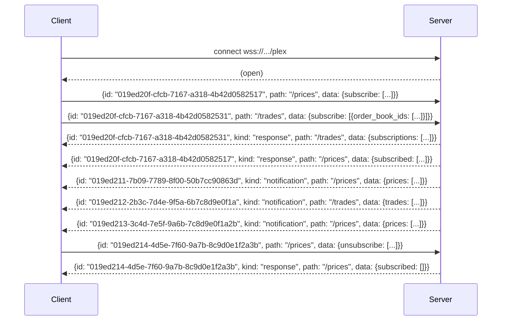
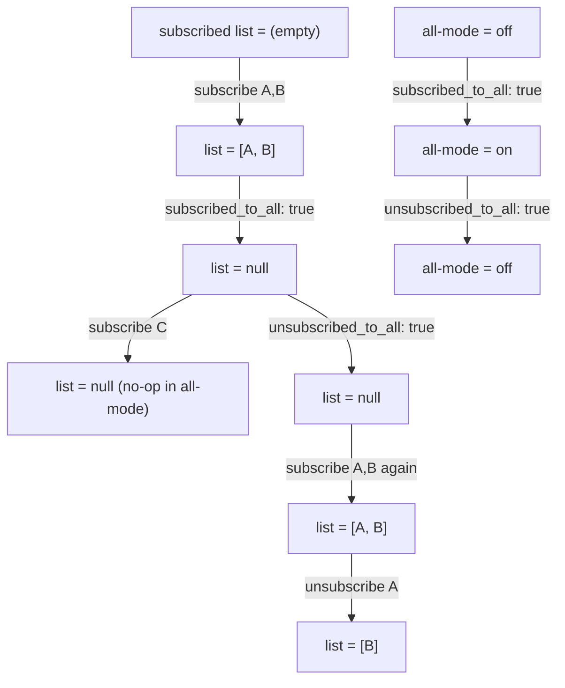

# Multiplexed WebSocket (`wsplex`)

DORA's **multiplexed WebSocket** protocol — `wsplex` — lets you carry requests, responses, and server-pushed notifications for multiple endpoints over a **single** connection. Where the [legacy streaming endpoints](../getting-started.md#streaming-apis) require one socket per stream, `wsplex` lets you subscribe to many streams and send many requests on one connection at once.

The endpoint is:

`wss://<environment_base_url>/plex`

For example, against staging: `wss://staging.dora.co/plex`.

Currently documented paths:

- [`/prices`](#path-prices) — real-time price updates for selected assets.
- [`/trades`](#path-trades) — trade updates by order book, optionally filtered by user.

Runnable examples in three languages:

- [Go](./examples/go/README.md)
- [Python](./examples/python/README.md)
- [TypeScript](./examples/typescript/README.md)

- [Multiplexed WebSocket (`wsplex`)](#multiplexed-websocket-wsplex)
  - [Connection & authentication](#connection--authentication)
  - [Protocol message shapes](#protocol-message-shapes)
    - [Request](#request)
    - [Response](#response)
    - [Notification](#notification)
  - [Request ID rule](#request-id-rule)
  - [Multiplexing on one connection](#multiplexing-on-one-connection)
  - [Path: `/prices`](#path-prices)
  - [Path: `/trades`](#path-trades)
  - [Adding new paths](#adding-new-paths)
  - [Error handling](#error-handling)
  - [Examples](#examples)

## Connection & authentication

The multiplexed WebSocket is reached at `wss://<environment_base_url>/plex`. Authentication uses the same header as the REST API:

`Authorization: ApiKey <your-api-key>`

`Authorization: Bearer <token>` works identically. **The `Authorization` header is required on the WebSocket upgrade request** — without it the connection will not be accepted. Once the socket is open, the same header authorizes requests on every path the token can access (for example, a token without `/trades` scope will see an error response on every `/trades` request, but the connection itself stays open).

A `User-Agent` header is **also required** on the WebSocket upgrade request. Send any non-empty string that identifies your client (for example, `MyDoraClient/1.0`). **Without it the server rejects the upgrade with HTTP `403`.** This header is only checked on the initial upgrade request; it is not needed on individual `wsplex` messages afterward.

## Protocol message shapes

Every message on the wire is a JSON object. There are three kinds.

### Request

```json
{
  "id": "019ed20f-cfcb-7167-a318-4b42d0582517",
  "path": "/prices",
  "data": {
    "subscribe": ["8f050119-00ec-49dc-b8ce-9447262f1253"]
  }
}
```

| Field | Type | Required | Notes |
|---|---|---|---|
| `id` | UUIDv7 string | yes | Single-use per connection. See [Request ID rule](#request-id-rule). |
| `path` | string | yes | Must start with `/`. |
| `data` | object | **yes** | The `data` field is required. Omitting it returns an error response and still consumes the request id. |

### Response

Every request receives **exactly one** response with the matching `id`. A response either has `data` (success) or `error` (failure):

```json
{
  "id": "019ed20f-cfcb-7167-a318-4b42d0582517",
  "kind": "response",
  "path": "/prices",
  "data": {
    "subscribed": ["019ed211-7b09-7789-8f00-50b7cc90863d"],
    "subscribed_to_all": false
  }
}
```

```json
{
  "id": "019ed20f-cfcb-7167-a318-4b42d0582517",
  "kind": "response",
  "path": "/prices",
  "error": "handler error: EOF: wanted a non-nil JSON value of type api.SubscriptionChange, got empty body"
}
```

### Notification

Notifications are server-pushed; the client never sends them.

```json
{
  "id": "019ed20f-cfcb-7167-a318-4b42d0582517",
  "kind": "notification",
  "path": "/prices",
  "data": {
    "prices": [
      {
        "asset_id": "019c3401-9737-7106-b3d3-b7a6e6eef0e6",
        "price": "0.717414207417403554",
        "ytm": "0",
        "time": "2026-06-19T13:42:00.427375Z"
      }
    ]
  }
}
```

## Request ID rule

The `id` field is **single-use per connection**:

- Reusing any `id` on the same socket returns a duplicate-request error — even if the previous request failed validation or returned any other error.
- For retries (after any failure) you **must** generate a fresh id.
- Use **UUIDv7**. The id is the only thing correlating a response back to its request, so it must be unique within the connection's lifetime.

This rule applies even to malformed requests. Omitting the required `data` field still consumes the id.

## Multiplexing on one connection

A single `wsplex` connection can carry requests and responses for many paths at once, plus interleaved notifications from each path:



Responses and notifications can arrive in any order; the client correlates responses by `id` and routes notifications by `path`.

## Path: `/prices`

Subscribe to real-time price updates for selected assets or for all assets.

### Mental model

The server has two pieces of state for `/prices`: a **subscribed list** of asset ids (initially empty) and a **subscribed_to_all** flag (initially `false`). The list is meaningful only while all-mode is off. Toggling all-mode on or off **resets the list to `null`**: any ids previously added are gone, and you must resubscribe after toggling all-mode off if you want a list again.

- `subscribe` adds ids to the list. While all-mode is `true`, `subscribe` is a no-op (the list is `null` and stays `null`).
- `unsubscribe` removes ids from the list. While all-mode is `true`, `unsubscribe` is not meaningful (the list is `null`) and returns an error response.
- `subscribed_to_all: true` turns all-mode on **and** resets the list to `null`.
- `unsubscribed_to_all: true` turns all-mode off **and** resets the list to `null`. It does **not** restore any list that was there before all-mode was enabled.

| Field | Type | Notes |
|---|---|---|
| `subscribe` | `string[]` (asset ids) | Additive — adds to the subscribed list. **No-op while `subscribed_to_all` is `true`.** |
| `unsubscribe` | `string[]` (asset ids) | Subtractive — removes from the subscribed list. Returns an error while `subscribed_to_all` is `true`. |
| `subscribed_to_all` | `bool` | Sets all-mode on. Also resets the subscribed list to `null`. |
| `unsubscribed_to_all` | `bool` | Sets all-mode off. Also resets the subscribed list to `null`. |

### Worked example

Assume the subscribed list starts empty and all-mode starts off.



Notifications at each step (the list in the `subscribed` column reflects the server's response):

| Step | Request sent | `subscribed` after | `subscribed_to_all` after | Notifications received |
|---|---|---|---|---|
| 1 | `{ subscribe: [A, B] }` | `[A, B]` | `false` | A, B |
| 2 | `{ subscribed_to_all: true }` | `null` | `true` | A, B, and every other asset (list is null; all-mode is on) |
| 3 | `{ subscribe: [C] }` | `null` | `true` | No change — `subscribe` is a no-op while all-mode is on |
| 4 | `{ unsubscribed_to_all: true }` | `null` | `false` | None — the list was null when all-mode was turned on, and `unsubscribed_to_all` does not restore it |
| 5 | `{ subscribe: [A, B] }` | `[A, B]` | `false` | A, B (subscribed again) |
| 6 | `{ unsubscribe: [A] }` | `[B]` | `false` | B |

> All-mode is **destructive**: turning it on or off clears the list. To get back to a list-filtered subscription after toggling all-mode, re-send `subscribe` with the ids you want.

### Response data

The response carries the post-change state. `subscribed` is `null` when all-mode is on or has just been toggled (the list is not meaningful in that state) and an array of asset ids otherwise:

```json
{
  "subscribed": null,
  "subscribed_to_all": true
}
```

### Notification data

```json
{
  "prices": [
    {
      "asset_id": "019c3401-9737-7106-b3d3-b7a6e6eef0e6",
      "price": "0.717414207417403554",
      "ytm": "0",
      "time": "2026-06-19T13:42:00.427375Z"
    }
  ]
}
```

## Path: `/trades`

Subscribe to real-time trade updates by order book, optionally filtered by user.

### Mental model

`/trades` has two independent axes:

- **Order-book axis** — a list of `order_book_ids`, plus an `order_books_all` flag.
- **User axis** — a list of `user_ids`, plus a `users_all` flag.

`users_all: true` is the implicit default: if a change object omits both `user_ids` and `users_all`, the server treats the user axis as `users_all: true` for that change. The canonicalized subscription in the response always reflects this — `users_all: true` will appear even when the request did not set it.

`unsubscribe` is a full state edit (not just a list-edit). Sending `unsubscribe: [{order_books_all: true}]` clears the `order_books_all` flag and the response shows an empty `subscriptions` array, so all-mode is not connection-scoped — it can be cleared without closing the connection.

### Clearing subscriptions

To fully clear subscription state on `/trades`, send `unsubscribe` with the changes you want to remove. For example, `unsubscribe: [{order_books_all: true, users_all: true}]` returns `subscriptions: []`. There is no need to close the connection to reset.

### Request data

```json
{
  "subscribe": [
    { "order_book_ids": ["019c3420-5cd7-7a88-8fe6-a5a622e01ad9"], "users_all": true },
    { "order_books_all": true, "user_ids": ["019c4d37-311e-7a2f-8d58-f17c39170865"] }
  ],
  "unsubscribe": [
    { "order_book_ids": ["019c3420-5cd7-7a88-8fe6-a5a622e01ad9"], "user_ids": ["019c4d37-311e-7a2f-8d58-f17c39170865"] }
  ]
}
```

### Response data

```json
{
  "subscriptions": [
    { "order_books_all": true, "users_all": true }
  ]
}
```

### Notification data

`/trades` payloads intentionally match the legacy non-plex field names:

```json
{
  "trades": [
    {
      "transaction_id": "019ee01d-f5f4-775d-b14a-4164a31ee592",
      "asset_0": "019c3401-9737-7106-b3d3-b7a6e6eef0e6",
      "created_at": "2026-06-19T13:42:00.427375Z",
      "order_book_id": "019c3420-5cd7-7a88-8fe6-a5a622e01ad9",
      "order_id": "019ee01d-f570-77de-a7ff-99aae476b4e5",
      "order_seq": 1,
      "price": "0.717414207417403554",
      "quantity_0": "591.3390000000000000",
      "user_id": "019c4d37-311e-7a2f-8d58-f17c39170865",
      "side": "BUY",
      "aggressor_indicator": true
    }
  ]
}
```

## Adding new paths

Future paths will follow the same request / response / notification contract described above. They will be documented here as they are released. To consume a new path, send a request with the new `path` and parse the response / notifications using the same `id` and `path` routing rules already in your client.

## Error handling

Every error arrives as a response message with the matching `id`, `kind: "response"`, and an `error` string field. Validation errors and handler errors look the same to the client.

Two consequences:

1. A malformed request (e.g. omitting the required `data` field, or using a duplicate `id`) **still consumes the request id**. The next request must use a fresh UUIDv7.
2. The `error` string is intended for humans. Don't pattern-match on its content.

## Examples

Machine-readable protocol spec ([AsyncAPI 3.0](./asyncapi.yaml)) and runnable demos in three languages:

- [Go](./examples/go/README.md) — uses [`coder/websocket`](https://github.com/coder/websocket).
- [Python](./examples/python/README.md) — uses the [`websockets`](https://pypi.org/project/websockets/) package.
- [TypeScript](./examples/typescript/README.md) — uses the [`ws`](https://www.npmjs.com/package/ws) package.
